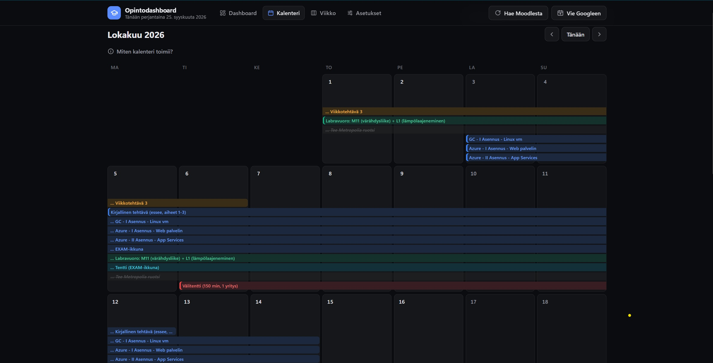

# Opintodashboard

Paikallinen opintodashboard SAMKin Moodlelle. Kokoaa kaikkien kurssiesi
deadlinet, tentit ja labrat yhteen paikkaan ja auttaa suunnittelemaan,
milloin kuhunkin tehtävään pitää tarttua. Kaikki toimii omalla koneellasi
pienellä Node.js-palvelimella: ei tiliä, ei pilvipalvelua eikä
npm-asennuksia.

**Ominaisuudet**

- **Dashboard:** tulevat deadlinet tiloineen (Avoin, Työn alla, Tehty,
  Ei tehdä), tuntiarviot ja laskettu "aloita viimeistään" -päivä.
- **Kalenteri:** kuukausinäkymä työskentelyjaksoista ja EXAM-tenttien
  varausikkunoista.
- **Viikko:** jakaa tehtävien tunnit päiville oman opiskeluaikasi mukaan.
- **Kurssisivut:** kurssin tehtävät, tenttitiedot ja Moodlesta haettu
  sisältö.
- **Hae Moodlesta:** uudet kurssit ja tehtävät löytyvät automaattisesti.
- **Kurssitiedot opinto-oppaasta:** opintopisteet, päivämäärät, kurssikoodi
  ja opettaja haetaan SAMKin julkisesta opinto-oppaasta.
- **Vie Googleen** (valinnainen): deadlinet Google-kalenteriin ja
  Google Tasksiin.
- **DeepSeek-tuntiarviot** (valinnainen): automaattinen aika-arvio uusille
  tehtäville.


| Kalenteri | Viikkosuunnitelma |
| --- | --- |
|  |  |

## Vaatimukset

- **Node.js 18 tai uudempi** (suositus: uusin LTS, https://nodejs.org).
  Muita riippuvuuksia ei ole, joten `npm install` ei ole tarpeen.
  Windowsilla ja macOS:llä asennusskripti tarjoutuu asentamaan Node.js:n,
  jos se puuttuu.
- Selain (Chrome, Edge, Firefox tai Safari).
- SAMKin Moodle-tunnukset, jos haluat hakea kurssit Moodlesta.

## Asennus

1. **Lataa projekti:**
   ```
   git clone https://github.com/DrTinkle/Opintodashboard.git
   ```
   tai GitHubista **Code > Download ZIP** ja pura kansio.
2. **Aja asennus:**
   - **Windows:** tuplaklikkaa `setup.bat`
   - **macOS / Linux:** `sh setup.sh`
   - **Tai mikä tahansa kone:** `npm run setup`

   Asennus tarkistaa Node.js:n, luo omat `data/data.json`- ja `.env`-tiedostosi
   esimerkeistä ja valmistelee kurssidatan. Sen voi ajaa uudelleen
   turvallisesti: jo olemassa oleviin omiin tiedostoihin se ei koske.
3. **Käynnistä:**
   ```
   npm start
   ```
   Selain avautuu osoitteeseen http://localhost:8080. Palvelin pysyy
   käynnissä komentoikkunassa, pysäytä se Ctrl+C:llä.

## Ensimmäinen käyttökerta

1. **Avaa Asetukset-välilehti** ja täytä:
   - **Moodle-kirjautuminen:** SAMK-käyttäjätunnus ja salasana
     (suositus, kirjautuminen hoituu sen jälkeen automaattisesti), TAI
     pelkkä MoodleSession-eväste selaimen kehittäjätyökaluista.
   - **Oma Moodle-käyttäjä-id:** numero, jonka näet Moodlessa oman
     profiilisivusi osoitteesta (`user/profile.php?id=12345`). Tarvitaan
     uusien kurssien löytämiseen.
   - **Ryhmätunnus** (esim. `AIC25SP`): kurssien opintopisteet,
     päivämäärät ja opettajat haetaan sen avulla SAMKin opinto-oppaasta.

   Paina **Tallenna muutokset**.
2. **Paina yläpalkin "Hae Moodlesta".** Ensimmäinen haku kestää pari
   minuuttia, minkä jälkeen kurssisi ja niiden tehtävät näkyvät
   dashboardilla. Kurssien tiedot (op, päivämäärät, koodi, opettaja)
   täydentyvät samalla automaattisesti SAMKin opinto-oppaasta.
3. **Poista esimerkkikurssit** ("Ohjelmoinnin perusteet" ja "Tietokannat")
   kurssikortin **Poista**-napilla.
4. **Jos kurssilla näkyy "Täydennä tiedot"**, sitä ei löytynyt
   opinto-oppaasta (esim. Library Moodle, joka ei ole oikea kurssi).
   Piilota se kurssikortin Poista-napilla, tai lisää tiedot käsin
   `data/data.json`:iin (`credits`, `teacher`, `start`, `end`) ja aja
   `npm run build`.

## Käyttö lyhyesti

- **Tila:** merkitse jokainen tehtävä Avoimeksi, Työn alla, Tehdyksi tai
  Ei tehdä. Tehtävä siirtyy omaan osioonsa.
- **Arvio ja Tahti:** kirjoita tehtävän arvioitu työmäärä (h) ja kuinka
  monta tuntia viikossa ehdit tehdä sitä. Dashboard laskee, milloin se
  pitää aloittaa viimeistään.
- **Uusi tehtävä / muokkaus:** lisää omia tehtäviä tai korjaa Moodlesta
  tulleita kynäkuvakkeesta.
- **Kurssisivu:** klikkaa kurssikorttia. Tentti-laatikossa valitset, onko
  kurssilla EXAM-tentti vai Moodle-tentti, ja voit merkitä varatun
  EXAM-päivän.
- **Viikko:** aseta jokaiselle viikonpäivälle, montako tuntia ehdit
  opiskella, niin näet mitä kunakin päivänä kannattaa tehdä.
- **Hae Moodlesta -tulos:** yläpalkin alla näkyy, montako kurssia ja
  tehtävää tarkistettiin ja montako määräaikaa Moodlesta löytyi. Vie hiiri
  tekstin päälle nähdäksesi erittelyn kursseittain.

> **Huom:** tilat, arviot, omat tehtävät ja muut merkinnät tallentuvat
> selaimen muistiin. Ne eivät siirry toiselle koneelle tai toiseen
> selaimeen.

## Valinnaiset lisäosat

- **Google-kalenteri:** vie deadlinet Google-kalenteriin ja Google
  Tasksiin muistutuksineen. Vaatii kertaluontoisen Google Cloud
  -asetuksen, ks. [docs/google-kalenteri.md](docs/google-kalenteri.md).
- **DeepSeek-tuntiarviot:** luo API-avain osoitteessa
  https://platform.deepseek.com ja lisää se Asetuksiin. Uudet Moodlesta
  löytyvät tehtävät saavat silloin automaattisen tuntiarvion. Ilman
  avainta kaikki muu toimii normaalisti.

## Tietosuoja

- Kaikki pysyy omalla koneellasi. Kirjautumistiedot tallentuvat vain
  `.env`-tiedostoon, eikä niitä näytetä Asetuksissa uudelleen.
- `.gitignore` pitää `.env`:n, kurssidatasi ja Google-tunnukset poissa
  gitistä. Älä silti jaa niitä kenellekään.
- Salasana tallennetaan `.env`:iin selkokielisenä. Jos et halua sitä,
  käytä pelkkää MoodleSession-evästettä.
- Opinto-oppaan haut ovat julkisia eivätkä vaadi kirjautumista. Niissä
  lähetetään vain koulutusohjelman tunnus, ei henkilötietoja.

## Kansiot

| Kansio | Sisältö |
| --- | --- |
| `public/` | Dashboardin käyttöliittymä (`index.html`) ja siitä generoitu kurssidata (`data.js`) |
| `data/` | Omat tietosi: kurssit (`data.json`), Google-kirjautuminen ja synkkojen tila. Ei gitissä, paitsi `data.example.json`. |
| `src/` | Koodi: palvelin, Moodle-skriptit (`src/moodle/`) ja integraatiot (`src/integrations/`) |
| `docs/` | Tekninen dokumentaatio ja kuvakaappaukset |
| `.env` | Asetukset ja kirjautumistiedot (projektin juuressa, ei gitissä) |

Jos päivität vanhemmasta versiosta, jossa kaikki tiedostot olivat samassa
kansiossa, `npm start` ja `npm run setup` siirtävät omat tiedostosi
automaattisesti oikeisiin kansioihin.

## Ongelmatilanteita

- **"Portti 8080 on jo käytössä":** käynnistä toiseen porttiin:
  `npm start -- --port 3000`.
- **Asetukset tai Hae Moodlesta eivät toimi:** avaa dashboard
  `npm start` -komennolla, ei suoraan `public/index.html`-tiedostona.
- **Hae Moodlesta antaa kirjautumisvirheen:** tarkista tunnukset
  Asetuksista. Jos käytät pelkkää evästettä, se on voinut vanhentua:
  hae uusi.
- **Uusia kursseja ei löydy:** tarkista, että oma Moodle-käyttäjä-id on
  asetettu.
- **"0 uutta" epäilyttää:** tila kertoo, montako kurssia ja määräaikaa
  tarkistettiin. Jos mitään ei voitu tarkistaa, se näkyy punaisena
  virheenä. Täysi raportti jokaisesta löydetystä tehtävästä on tiedostossa
  `data/sync_report.json`.
- **Kurssin tiedot puuttuvat:** tarkista, että ryhmätunnus on asetettu.
  Opinto-oppaassa ei ole kaikkia opintoja (esim. Library Moodle).

## Kehittäjille

Tekninen kuvaus (tiedostot, tietomalli, skriptit ja Moodle-integraation
yksityiskohdat) on tiedostossa [docs/INDEX.md](docs/INDEX.md). Ohjeet
koodin muokkaamiseen (myös AI-agenteille) ovat tiedostossa
[AGENTS.md](AGENTS.md).
