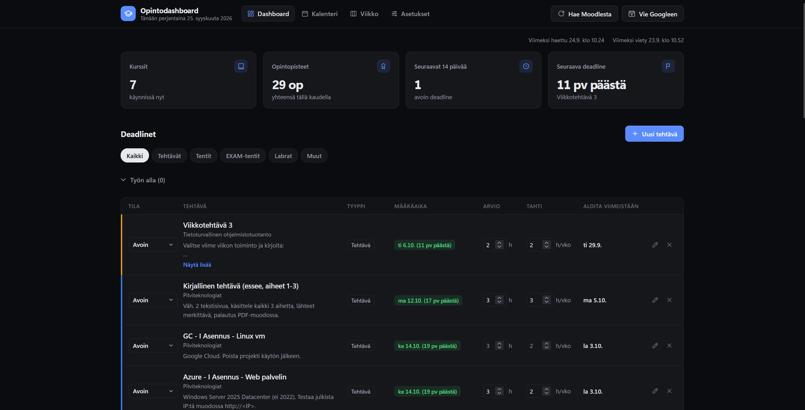
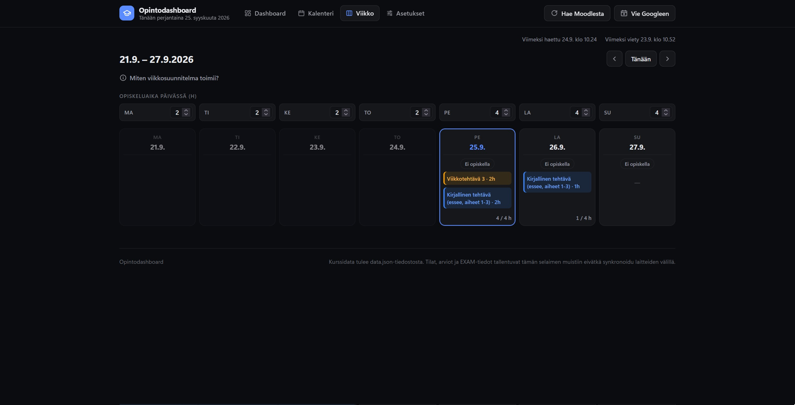

# Opintodashboard

Yhden sivun dashboard kaikkien tämän syksyn kurssien deadlineista.
Ajetaan pienellä paikallisella Node-palvelimella (localhost), ei muita
asennuksia.



| Kalenteri | Viikkosuunnitelma |
| --- | --- |
|  |  |

## Vaatimukset

- **Node.js 18 tai uudempi** (suositus: uusin LTS, https://nodejs.org).
  Muita riippuvuuksia ei ole: projekti ei käytä yhtään npm-pakettia, joten
  `npm install` ei ole tarpeen. Vaatimukset on kirjattu `package.json`:iin
  (`engines`), joka on Node-projektin vastine Pythonin requirements.txt:lle.
- Selain (Chrome, Edge, Firefox tai Safari, uusi versio).

## Käyttöönotto (jos kloonasit tämän repon)

Jokainen käyttää dashboardia omalla koneellaan omalla kurssidatallaan –
mitään ei jaeta muiden kanssa automaattisesti, ja kaikki henkilökohtaiset
tiedot (oma kurssidata, kirjautumiset) jäävät vain sinun koneellesi
(`.gitignore` jättää ne pois repoista).

1. **Kloonaa/lataa tämä kansio** koneellesi.
2. **Aja asennus:**
   - **Windows:** tuplaklikkaa `setup.bat`. Jos Node.js puuttuu, skripti
     tarjoutuu asentamaan sen wingetillä (kysyy ensin).
   - **macOS/Linux:** `sh setup.sh` (macOS:llä tarjoutuu asentamaan
     Node.js:n Homebrew'lla, jos se puuttuu).
   - **Tai suoraan:** `npm run setup` (tai `node setup.js`).

   Asennus tarkistaa Node.js-version, luo `data.json`:in
   esimerkkikursseista (`data.example.json`) ja tyhjän `.env`-pohjan,
   ja generoi `data.js`:n. Olemassa oleviin omiin tiedostoihin se ei koske,
   joten sen voi ajaa uudelleen turvallisesti.
3. **Käynnistä dashboard:** `npm start` (tai `node server.js`, ks.
   seuraava osio). Asennusskripti tarjoaa myös käynnistystä heti.
4. **Täytä omat asetuksesi:** avaa dashboardin yläreunasta
   "Asetukset"-välilehti. Sinne täytetään Moodle-kirjautuminen
   (käyttäjätunnus+salasana TAI pelkkä MoodleSession-eväste, kumpi
   tahansa riittää), oma Moodle-käyttäjä-id (tarvitaan uusien kurssien
   löytämiseen "Hae Moodlesta" -napilla ja `find_moodle_ids.js`:lle; löytyy
   Moodlen kalenterin ICS-vientilinkin `userid=`-parametrista tai omalta
   profiilisivulta), Google-kalenterisynkan OAuth-tiedot
   (valinnainen) ja DeepSeek-API-avain (valinnainen – ilman sitä uudet
   tehtävät lisätään vain ilman automaattista tuntiarviota). Kaikki
   tallentuu vain koneellesi `.env`-tiedostoon, ei koskaan git-repoon;
   ks. tarkemmin osio "Mitä dashboard näyttää" alla (kohta
   "Asetukset-välilehti").
5. **Hae omat kurssisi ja tehtäväsi Moodlesta:** kun Moodle-kirjautuminen
   on asetettu, dashboardin "Hae Moodlesta" -nappi löytää uudet
   kurssit ja tehtävät automaattisesti. `find_moodle_ids.js` täyttää
   kurssien Moodle-id:t jos haluat myös sisältöskannauksen
   (`scrape_course_content.js`) toimimaan.

`.env.example` on yhä tallella niitä varten jotka haluavat muokata
`.env`-tiedostoa suoraan komentoriviltä Asetukset-välilehden sijaan –
molemmat tekevät saman asian.

## Käynnistys

```
node server.js
```

Avaa selaimen automaattisesti osoitteeseen `http://localhost:8080`. Jos
portti 8080 on varattu, käytä toista: `node server.js --port 3000`.
Palvelin pysyy käynnissä siinä terminaali-ikkunassa, pysäytä se Ctrl+C:llä.

## Tiedostot

- `package.json` — projektin kuvaus, Node-vaatimus (`engines`) ja
  npm-komennot (`npm start`, `npm run setup`, `npm run sync:moodle` ...)
- `setup.js`, `setup.bat`, `setup.sh` — käyttöönotto (ks. yllä)
- `images/` — README:n kuvakaappaukset
- `server.js` — pieni staattinen HTTP-palvelin (ei riippuvuuksia), tarjoaa
  dashboardin localhostista
- `index.html` — itse dashboard (näkymä, ei sisällä dataa)
- `data.json` — kurssit ja deadlinet, tätä muokataan käsin
- `data.js` — **generoitu** `data.json`:sta, `index.html` lukee tämän. Älä
  muokkaa suoraan, se ylikirjoittuu seuraavalla `node build.js` -ajolla.
- `build.js` — regeneroi `data.js`:n `data.json`:sta (aja käsin muokkauksen jälkeen)
- `update_from_moodle.js` — hakee Moodlen kalenterin ICS-viennistä uudet
  deadlinet ja täydentää niillä `data.json`:ia automaattisesti
- `scrape_course_content.js` — hakee kurssin Moodle-sivulta sen aihealueet
  ja materiaalit/linkit (tiedostot, tehtävät, Webex-linkit ym.) ja
  täydentää niillä `data.json`:ia
- `find_moodle_ids.js` — hakee automaattisesti kaikkien kurssien
  Moodle-id:t (`moodleId`) profiilisivultasi, jotta `scrape_course_content.js`
  tietää mistä osoitteesta mikäkin kurssi löytyy
- `find_deadlines.js` — käy läpi kaikkien kurssien tehtävät/tentit
  (Moodle-tyypit `assign`/`quiz`/`workshop`) ja poimii niiden määräajat ja
  kuvaustekstit tiedostoon `deadline_scan.json`, jotta piilossa olevat
  deadlinet löytyvät ilman että jokaista Moodle-sivua tarvitsee avata käsin
  (ks. "Piilossa olevien deadlinejen etsiminen" alla)
- `sync_moodle.js` — etsii kokonaan uudet kurssit ja uudet tehtävät/tentit
  Moodlesta ja lisää ne suoraan `data.json`:iin (dashboardin "Hae
  Moodlesta" -nappi ajaa tämän `server.js`:n kautta, ks. alla)
- `estimate_deepseek.js` — pyytää DeepSeekin API:lta `estimatedHours`-/
  `estimatedPace`-arvion jokaiselle aidosti uudelle tehtävälle jonka
  `sync_moodle.js`/`update_from_moodle.js` löytää (ks. "DeepSeek-aika-arviot
  uusille tehtäville" alla)
- `sync_to_google.js` — vie `data.json`:in deadlinet Google Tasksiin ja
  Google Calendariin
- `refresh_moodle_session.js` — kirjautuu Moodleen automaattisesti
  käyttäjätunnuksella/salasanalla ja päivittää `MOODLE_SESSION`:in
  `.env`-tiedostoon
- `load_env.js` — pieni `.env`-tiedoston lukija, jota muut skriptit
  käyttävät
- `.env` / `.env.example` — avaimet ja kirjautumistiedot (`.env` ei ole
  kenellekään jaossa, `.env.example` on malli)
- `README.md` — tämä tiedosto

Vaatii Node.js:n (koneellasi on jo 24.x), ei muita riippuvuuksia.

Data-tiedostoja (`data.json`, `data.js`) voi päivittää palvelimen ollessa
käynnissä ihan normaalisti — selaimessa riittää sivun uudelleenlataus
(F5) päivityksen jälkeen, palvelinta ei tarvitse käynnistää uudelleen.

## Mitä dashboard näyttää

- Käyttöliittymä: yläreunan kiinteässä palkissa ovat näkymät (Dashboard,
  Kalenteri, Viikko, Asetukset) sekä Moodle- ja Google-synkkanapit.
  Synkkojen tila ("Viimeksi haettu..." jne.) näkyy heti palkin alla.
  Vaalea ja tumma teema vaihtuvat automaattisesti käyttöjärjestelmän
  asetuksen mukaan, ja sivu toimii myös puhelimen levyisenä. Kalenterin ja
  viikkonäkymän pitkät selitykset ovat kokoontaitettavan "Miten tämä
  toimii?" -linkin takana, ja pitkät Moodle-kuvaukset tiivistetään
  deadline-listassa kahdelle riville ("Näytä lisää" avaa koko tekstin).
- Yhteenveto: kuinka monta kurssia käynnissä, yhteensä opintopisteitä,
  kuinka moni deadline avoinna seuraavan 14 päivän aikana, seuraava deadline
- Deadline-lista lähimmästä kauimpaan, suodatettavissa tyypin mukaan
  (tehtävä / tentti / labra / muu), värikoodattu kiireellisyyden mukaan
- Menneet deadlinet omassa auki-klikattavassa osiossa
- Jokaisella deadline-rivillä "Tila"-pudotusvalikko: Avoin / Työn alla / Tehty
  / Ei tehdä. Kun tehtävä merkitään joksikin muuksi kuin Avoimeksi, se siirtyy
  heti pois avointen tehtävien listalta omaan osioonsa ("Työn alla" / "Tehdyt"
  / "Ei tehdä", kukin oma auki-klikattava osionsa dashboardilla ja kurssin
  profiilisivulla — "Työn alla" näkyy näistä ensimmäisenä, ennen avoimia
  tehtäviä) — vasta kun tehtävän määräaika on kokonaan mennyt, se
  siirtyy sieltä "Menneet"-osioon niin kuin ennenkin, tilasta riippumatta.
  "Työn alla" -tehtävälle voi lisäksi asettaa valmiusprosentin (0–100 %),
  jotta näkee suoraan paljonko kustakin kesken olevasta on vielä jäljellä.
  "Työn alla" tai "Tehty" -tilassa oleva tehtävä ei myöskään enää näytä
  "(myöhässä)"-leimaa "Aloita viimeistään" -sarakkeessa, vaikka laskennallinen
  aloituspäivä olisi jo mennyt — kesken tai valmiiksi merkittyä työtä ei ole
  mielekästä kutsua myöhässä olevaksi. Mikään näistä tiloista ei enää lasketa
  mukaan yhteenvedon avoimiin deadlineihin. Jokaisella rivillä on myös
  rastikuvakkeella merkitty nappi kohteen poistamiseksi listalta kokonaan (varmistus kysytään ennen
  poistoa) - poistetut kohteet löytyvät "Poistetut"-osiosta "Palauta"-napin
  takaa, jos poisto oli vahinko. Kaikki nämä (tila, valmiusprosentti) tallentuvat
  vain selaimen omaan muistiin, ei siis synkkaa laitteiden tai selainten
  välillä.
- Kurssikortit: opintopisteet, opettaja, kesto ja kuinka paljon kurssista
  on kulunut
- Jokaisella kurssilla oma "profiili"-näkymä (klikkaa kurssikorttia):
  omat deadlinet, linkit, edistyminen ja "Sisältö"-osio jossa kurssin
  aihealueet ja materiaalit (jos ne on haettu Moodlesta, ks. alla)
- Kalenterinäkymä (yläpalkin "Kalenteri"-linkki): kuukausiruudukko jossa
  jokaisen päivän kohdalla näkyy sille osuvat deadlinet väreillä kurssin
  mukaan, klikkaa päivää nähdäksesi sen deadlinet tarkemmin alapuolella.
  Pieni väritetty chippi päivälaatikon sisällä näkyy vain niille kohteille
  joilla EI ole omaa työskentelypalkkia (eli Arvio/Tahti-kenttiä ei ole
  täytetty) — jos kohteella on palkki, se jo riittää eikä samaa tehtävää
  näytetä tuplana sekä chippinä että palkkina sen deadline-päivänä.
  Nuolilla vaihdat kuukautta, "Tänään"-nappi palaa nykyhetkeen. Jokaisen
  viikon alla näkyy myös väripalkki jokaiselle kohteelle jolla on sekä
  "Arvio"- että "Tahti"-kenttä täytetty: palkki kattaa koko arvioidun
  työskentelyjakson aloituspäivästä deadlineen asti ja jatkuu tarvittaessa
  usean viikon ja kuukauden yli (katkaistu reuna + "…" tekstin alussa
  kertoo että jakso jatkuu edelliseltä viikolta). Palkkia klikkaamalla
  pääsee suoraan sen deadline-päivän tarkempaan näkymään. Päällekkäiset
  jaksot pinoutuvat omille riveilleen samalla viikolla. EXAM-ikkunallisille
  tenteille (ks. alla) näkyy tämän lisäksi oma katkoviivareunainen palkki
  koko varausikkunalle: kirkas osuus kertoo minkä osan ikkunasta voi jo
  varata EXAM-järjestelmässä juuri nyt, ruudukkokuvioitu osuus sen minkä
  osan varaus ei ole vielä auennut (EXAM avaa aikoja vain n. 30 vrk
  etukäteen). Tehdyksi tai "ei tehdä" -merkityt kohteet näkyvät kalenterissa
  harmaina ja yliviivattuina sekä tavallisissa työskentelypalkeissa,
  EXAM-ikkunapalkeissa että pienissä päivälaatikon chipeissä (kohteilla joilla
  ei ole omaa työskentelypalkkia). Päivää klikattaessa alapuolella näkyvässä
  päivänäkymässä on deadlinejen lisäksi oma "Työn alla tänä päivänä"
  -osio: kaikki ne kohteet joiden arvioitu työskentelyjakso (sama laskenta
  kuin väripalkeissa) kattaa juuri sen päivän, vaikka niiden deadline olisi
  vasta myöhemmin — näin näkee suoraan mitä sinä päivänä pitäisi olla
  tekemässä, ei vain mikä sinä päivänä erääntyy. Rivin klikkaus vie
  kyseisen kohteen omaan deadline-päivään, paitsi tehtävän NIMEN klikkaus
  joka vie sen sijaan suoraan kurssin Moodle-etusivulle (ks. alla) uuteen
  välilehteen.
- Viikkonäkymä (yläpalkin "Viikko"-linkki): jakaa automaattisesti tuntimäärän
  kaikille tehtäville joiden "Aloita viimeistään" -päivä on tänään tai mennyt,
  tai jotka on merkitty "Työn alla" — Tehdyt ja Ei tehdä -tehtävät jäävät aina
  pois. Jako on ahne: aikaisin deadline ensin, täytetään päivän jäljellä oleva
  opiskeluaika (oma säädettävä tuntimäärä jokaiselle viikonpäivälle, Ma–Su)
  ennen seuraavaan tehtävään siirtymistä, eikä koskaan yli tehtävän oman
  deadlinen. Koko Arvio jaetaan aina riippumatta valmiusprosentista. Jos
  tehtävät eivät mahdu nykyisellä opiskelutahdilla, näkyy varoitus siitä mitkä
  tehtävät ja kuinka monta tuntia jäävät jakamatta; tehtävät joilta puuttuu
  Arvio-tuntimäärä listataan erikseen omana "ei aika-arviota" -listanaan
  koska niitä ei voida aikatauluttaa. Nuolilla vaihdat viikkoa, "Tänään"-nappi
  palaa nykyiseen viikkoon — itse allokointi lasketaan aina tästä päivästä
  eteenpäin, joten se pysyy samana riippumatta siitä mitä viikkoa selaat.
  Jo myöhässä olevat tehtävät (oma deadline mennyt, mutta silti "Työn alla"
  tai muuten mukaan kelpaava) saavat silti tunteja normaalisti ja korkealla
  prioriteetilla, sen sijaan että jäisivät kokonaan ilman — deadline-rajaa
  ei sovelleta enää menneisiin deadlineihin, koska se estäisi tehtävän
  aikatauluttamisen täysin. Jokaisella tulevalla/tämän päivän sarakkeella on
  myös "Ei opiskella" -nappi, jolla voi merkitä ettei sinä päivänä opiskella
  ollenkaan (esim. jotain muuta menoa) — nollaa sen yhden päivän kapasiteetin
  riippumatta viikonpäiväasetuksesta, ja tunnit siirtyvät automaattisesti
  seuraaville päiville. Päiväkohtainen opiskeluaika-asetus ja "Ei opiskella"
  -merkinnät tallentuvat vain tähän selaimeen. Arvio-tuntimäärä otetaan
  huomioon riippumatta siitä onko se data.json:in/Moodlen/DeepSeekin oma
  alkuperäinen arvio vai rivin "Arvio: _h" -kenttään käsin kirjoitettu luku
  (molemmat toimivat samalla tavalla myös "Aloita viimeistään" -laskennassa).
- Jokaisen deadline-rivin (dashboardilla, kurssin profiilissa ja kalenterin
  päivänäkymässä) sekä "Työn alla tänä päivänä" -rivin tehtävän nimi on
  klikattava linkki, joka avaa kyseisen kurssin Moodle-etusivun uuteen
  välilehteen (perustuu data.json:in moodleId-kenttään). Ei vielä linkkiä
  suoraan yksittäiseen tehtävään Moodlessa — se vaatisi jokaisen kohteen
  oman Moodle-aktiviteetti-ID:n (cmid) tallentamista dataan, mitä ei
  toistaiseksi kerätä. Kursseilla joilta moodleId puuttuu (esim. Minä Oy)
  nimi ei ole linkki.
- Jokaisella deadline-rivillä "Arvio: _h" ja "Tahti: _h/vko" -kentät: kun
  molemmat täytetään, rivi laskee itse ja näyttää "Aloita viimeistään"
  -päivän (punaisella jos se on jo mennyt). Osaan deadlineista (löydetty
  find_deadlines.js-skannauksesta, ks. alla) on jo valmiiksi täytetty
  Claude-tekemä tuntimäärä-/tahtiarvio data.json:in estimatedHours-/
  estimatedPace-kentistä — nämä näkyvät katkoviivareunuksisina kentiä ja
  tekstillä "(oma arvio, muokkaa vapaasti)" kunnes muokkaat jompaakumpaa
  kenttää, jolloin arvosi tallentuu selaimen omaan muistiin normaalisti
  eikä oletusarvoa enää näytetä. Tallentuu vain selaimen omaan muistiin,
  samoin kuin tila- ja poistotiedot.
- Kurssin profiilisivulla oma "Tentti"-laatikko: valitaan onko kurssilla
  itse varattava EXAM-tentti, Moodle-tentti, vai ei tenttiä ollenkaan. Jos
  EXAM-järjestelmä, voi asettaa "Suoritettava viimeistään" -päivän (milloin
  tentti pitää viimeistään olla suoritettuna — ei siis varattuna, vaan
  tehtynä) ja "Varattu EXAM-päivä" (kun varaus on tehty) — nämä näkyvät
  myös pienenä merkintänä kurssikortissa etusivulla. Osalla kursseista, joilla
  on tiedossa EXAM-ikkuna (data.json:in estimatedHours-/estimatedPace-kenttien
  tapaan nyt myös examWindowStart-/examWindowEnd-kentistä), "EXAM-järjestelmä"
  ja "Suoritettava viimeistään" -päivä on jo valmiiksi esitäytetty samalla
  katkoviivatyylillä kuin tuntiarviotkin — muokkaa vapaasti jos tilanne on
  toinen. Koska EXAM-järjestelmässä ajan voi varata vain noin 30 vuorokautta
  etukäteen, laatikossa näkyy myös lyhyt tilannekuva: onko koko ikkuna jo
  varattavissa ("täysi"), vain osa siitä lähipäiviltä ("osittain", jolloin
  näkyy arvioitu päivä mihin asti aikoja jo näkyy), vai ei varattavissa vielä
  ollenkaan (jolloin näkyy arvio montako päivää varaus vielä aukeamiseen).
  Sama tieto tiivistettynä näkyy myös kurssikortin merkinnässä (vihreä =
  varattavissa ainakin osittain, harmaa = ei vielä auki) ja pääsivun
  deadline-listalla suoraan kyseisen tentin rivin alla, joten ei tarvitse
  avata kurssin profiilisivua nähdäkseen onko aikoja jo tarjolla. Kun
  "Varattu EXAM-päivä" täytetään, kyseisen tentin rivi
  deadline-listalla (ja merkintä kurssikortissa) vaihtuu automaattisesti
  näyttämään alkuperäisen tenttipäivän sijaan varatun EXAM-päivän, otsikolla
  "— EXAM varattu" ja huomautuksella ettei paperitenttiä oletettavasti enää
  tehdä — oletuksena siis että jos molemmat ovat tarjolla, EXAM menee aina
  paperitentin edelle. Rivin oma tuntiarvio/tahti/tila säilyy ennallaan vaikka
  näytettävä päivämäärä vaihtuu. Tallentuu selaimen omaan muistiin.
- **EXAM-tentit ovat oma tehtäväluokka**, erillään tavallisista Moodle-tenteistä
  ("Tentti"), koska EXAM-tentit ovat paljon tärkeämpiä. Aiemmin kaikki `type:
  "exam"` -kohteet (niin EXAM-ikkunalliset kuin perinteiset luokkatentitkin)
  näkyivät samalla "Tentti"-badgella; nyt kohde saa oman "EXAM"-badgen (näkyy
  myös hieman korostettuna värillä) heti kun kurssin Tentti-widgetissä
  tenttivalinta on (tai oletusarvoisesti olisi, jos et ole vielä valinnut
  mitään) "EXAM-järjestelmä". Jos valitset saman widgetin kautta
  "Moodle-tentti" tai "Ei tenttiä", kyseisen kurssin tenttirivi palautuu
  automaattisesti tavalliseksi "Tentti"-tyypiksi — luokitus siis seuraa aina
  reaaliaikaisesti Tentti-widgetin valintaa, ei tarvitse muokata riviä erikseen.
  "EXAM" näkyy myös omana suodatinnappina ("EXAM-tentit") Deadlinet-osion
  chip-rivillä sekä "Uusi tehtävä" -lomakkeen tyyppivalikossa, joten voit
  halutessasi merkitä myös itse lisäämäsi tehtävän EXAM-kategoriaan käsin.
  Tämä on ensimmäinen vaihe isommasta EXAM/Moodle-erottelusta — EXAM-tenttien
  mahdollinen piilottaminen tavallisista Avoimet/Työn alla -listoista (ettei
  sama tentti näy kahdessa paikassa) ja Moodle-tenttien oma merkintä ovat
  vielä auki olevia jatkokysymyksiä.
- Tehtävien muokkaus ja omien tehtävien luonti dashboardin kautta (ei siis
  tarvitse käsin muokata data.json:ia): "Deadlinet"-otsikon vieressä sekä
  dashboardilla että kurssin profiilisivulla on "Uusi tehtävä" -nappi, ja
  jokaisella deadline-rivillä on nyt kynäkuvakkeella merkitty muokkausnappi rastikuvakkeella merkityn poistonapin
  vieressä. Kynä-nappi avaa lomakkeen jolla voi muokata otsikkoa, päivää,
  tyyppiä ja muistiinpanoja — Moodlesta skannatulla tehtävällä kurssia ei voi
  vaihtaa (koska se on sidottu Moodle-dataan) eikä Arvio/Tahti-kenttiä
  muokata lomakkeesta (ne muokataan suoraan rivin omista kentistä kuten
  ennenkin); jos muokkaus on tehty, lomakkeessa näkyy "Poista muokkaus"
  -nappi joka palauttaa alkuperäisen Moodle-datan. "Uusi tehtävä" -napilla
  luodaan kokonaan oma tehtävä: voi valita kurssin (tai jättää ilman, jolloin
  se näkyy "Oma tehtävä" -nimellä), otsikon, päivän, tyypin, muistiinpanot
  sekä halutessaan suoraan Arvio-/Tahti-kentät (jolloin se saa heti myös
  oman työskentelypalkin kalenteriin, jos molemmat on täytetty). Omia
  tehtäviä voi myöhemmin muokata tai poistaa samalla tavalla kuin
  Moodle-tehtäviä (kynä-/poistonapit), ja niiden kurssin voi myös vaihtaa
  jälkikäteen. Sekä muokkaukset että omat tehtävät tallentuvat vain selaimen
  omaan muistiin (localStorage), eivät siis data.json:iin eivätkä synkkaa
  laitteiden/selainten välillä — jos Moodlesta päivitetään data uudelleen
  (update_from_moodle.js), tehdyt muokkaukset säilyvät koska ne on sidottu
  tehtävän alkuperäiseen kurssi+päivä+otsikko-yhdistelmään eikä esim. pelkkään
  otsikkoon.
- **Asetukset-välilehti** kokoaa kaikki `.env`-tiedoston asetukset yhteen
  näkymään dashboardin yläreunasta, jotta niitä ei tarvitse muokata käsin
  tekstitiedostosta: Moodle-kirjautuminen (käyttäjätunnus+salasana JA
  MoodleSession-eväste näkyvät tasavertaisina vaihtoehtoina — kumpi tahansa
  riittää), oma Moodle-käyttäjä-id (`find_moodle_ids.js`:ää varten),
  Google-kalenterisynkan OAuth-client-id/-secret sekä DeepSeek-API-avain.
  DeepSeek on merkitty selvästi "Valinnainen" — ilman sitä uudet tehtävät
  lisätään aivan normaalisti, ainoastaan automaattinen tuntiarvio jää
  tekemättä. Turvallisuussyistä tallennettuja arvoja ei koskaan näytetä
  takaisin lomakkeessa: jokaisen kentän kohdalla näkyy vain tila-merkintä
  ("Asetettu" / "Ei asetettu"), ja arvon voi joko korvata kirjoittamalla
  uuden tilalle tai poistaa erikseen "Tyhjennä"-napista — tyhjäksi
  jätetty kenttä ei siis muuta mitään. Tallennus kirjoittaa vain
  muuttuneet arvot suoraan `.env`-tiedostoon säilyttäen kaikki muut rivit
  ennallaan, joten `.env.example` on yhä tallella niitä varten jotka
  haluavat muokata tiedostoa suoraan komentoriviltä tämän välilehden
  sijaan.

## Datan päivittäminen käsin

1. Avaa `data.json`
2. Muokkaa/lisää kohteita — jokainen kurssi on oma objekti taulukossa,
   `deadlines`-lista voi olla tyhjä (näkyy dashboardissa "Ei vielä
   deadline-tietoja") tai täynnä kohteita
3. Aja `node build.js`
4. Lataa sivu uudelleen selaimessa (F5) — palvelimen ei tarvitse olla käynnissä uudelleen

Kenttien merkitys per deadline-kohde:

- `title` — mitä
- `date` — `"YYYY-MM-DD"`
- `type` — `"task"` (palautettava), `"exam"` (tentti), `"lab"` (labravuoro)
  tai `"event"` (muu)
- `notes` — lisätiedot (valinnainen)

## Datan päivittäminen automaattisesti Moodlesta

`update_from_moodle.js` hakee Moodlen oman kalenterin ICS-vientilinkistä
tapahtumat, tunnistaa niistä kurssin otsikon perusteella ja lisää
puuttuvat deadlinet `data.json`:iin (ei koskaan tuplaa jo olemassa olevia,
tunnistus tapahtuu päivämäärä + otsikko -parilla).

**ICS-linkin hakeminen Moodlesta (tehdään kerran, tai aina kun linkki vanhenee):**

1. Kirjaudu Moodleen (moodle5.samk.fi) ja avaa Kalenteri
2. Rataskuvake / "Kalenterin asetukset" → "Export calendar" ("Vie kalenteri")
3. Valitse tapahtumat (esim. "Kaikki tapahtumat") ja aikaväli (esim. "Kaikki
   tapahtumat" on turvallisin valinta jotta mikään ei jää pois)
4. "Get calendar URL" / "Hae vientilinkki" — kopioi linkki. Se sisältää
   salaisen `authtoken`-parametrin, älä jaa sitä kenellekään äläkä committaa
   sitä mihinkään.

**Ajaminen:**

```
node update_from_moodle.js --url "https://moodle5.samk.fi/calendar/export_execute.php?...&authtoken=..."
```

tai jos latasit ics-tiedoston käsin selaimella:

```
node update_from_moodle.js --file kalenteri.ics
```

Lisää `--dry-run` nähdäksesi mitä tehtäisiin kirjoittamatta mitään:

```
node update_from_moodle.js --url "..." --dry-run
```

Skripti tulostaa myös listan tapahtumista joita se ei osannut yhdistää
mihinkään kurssiin — jos joukossa on tuttu kurssi, lisää sen tunnistesana
`update_from_moodle.js`:n alussa olevaan `COURSE_KEYWORDS`-taulukkoon ja aja
uudelleen.

## Kurssin sisällön hakeminen Moodlesta (aihealueet, materiaalit, linkit)

`scrape_course_content.js` hakee kurssin oman Moodle-sivun (course/view.php),
lukee siitä aihealueet ("Aihe 1", "Aihe 2" jne.) ja jokaisen aihealueen
materiaalit (tiedostot, kansiot, tehtävät, linkit, ilmoitusalueet ym.) ja
tallentaa ne `data.json`:in kunkin kurssin `topics`-kenttään. Nämä näkyvät
kurssin profiilisivulla "Sisältö"-osiossa.

Tämä sivu vaatii kirjautumisen (toisin kuin kalenterin ICS-vienti jolla oli
oma erillinen `authtoken`), joten tunnistautuminen hoidetaan selaimen
istunto-evästeellä.

**1. Hae kurssien `moodleId`:t automaattisesti `find_moodle_ids.js`:llä
(tehdään kerran, tai kun uusia kursseja ilmestyy):**

Jokainen kurssi tarvitsee `data.json`:iin numeerisen `moodleId`-kentän
(sama numero joka näkyy osoitteessa `course/view.php?id=<numero>`), jotta
`scrape_course_content.js` tietää minkä sivun se hakee. Näitä ei tarvitse
etsiä käsin joka kurssilta — `find_moodle_ids.js` hakee ne kaikki kerralla
omalta profiilisivultasi Moodlessa ja täsmää ne kurssin nimen perusteella:

```
node find_moodle_ids.js --session "<MoodleSession-arvo>"
```

Lisää `--dry-run` nähdäksesi täsmäytykset kirjoittamatta mitään. Skripti
ei koske kursseihin joilla on jo `moodleId` (Pilviteknologiat on jo
valmiina), ja tulostaa lopuksi listan jos jokin kurssi jäi ilman varmaa
täsmäystä (esim. jos kurssin nimi Moodlessa poikkeaa paljon `data.json`:in
nimestä) — silloin voi laittaa `moodleId`:n käsin listatun id:n perusteella.

Skripti käyttää oletuksena tunnettua Moodle-käyttäjä-id:täsi. Jos se on
väärä (esim. tili vaihtunut), anna oma id `--userid`-lipulla — sen näkee
mm. kalenterin ICS-vientilinkin `userid=`-parametrista tai omalta
profiilisivultasi Moodlessa.

**2. Hae MoodleSession-eväste (tehdään aina kun eväste vanhenee):**

1. Kirjaudu Moodleen selaimessa (moodle5.samk.fi)
2. Avaa DevTools (F12) → "Application"-välilehti (Chrome) tai "Storage"
   (Firefox) → Cookies → `moodle5.samk.fi`
3. Etsi rivi `MoodleSession` ja kopioi sen arvo (Value-sarake)
4. Tämä eväste on henkilökohtainen kirjautumistieto — älä jaa sitä
   kenellekään äläkä committaa sitä mihinkään

**Ajaminen:**

```
node scrape_course_content.js --session "<MoodleSession-arvo>"
```

Vaihtoehtoisesti voit laittaa arvon `.env`-tiedostoon (kopioi
`.env.example` nimelle `.env` jos sitä ei vielä ole) kenttään
`MOODLE_SESSION=...`, jolloin `--session`-lippua ei tarvitse antaa joka
kerta erikseen. `--session` voittaa jos annat molemmat.

**Täysin automaattinen kirjautuminen (ei DevToolsia enää ollenkaan):**

Jos täytät `.env`-tiedostoon myös `MOODLE_USERNAME` ja `MOODLE_PASSWORD`
(SAMK-tunnuksesi), `scrape_course_content.js` ja `find_moodle_ids.js`
tarkistavat automaattisesti ennen ajoa onko `MOODLE_SESSION` yhä voimassa,
ja jos ei ole, kirjautuvat itse SAMK:in kirjautumisen (Shibboleth-SSO)
kautta ja päivittävät tuoreen evästeen `.env`-tiedostoon puolestasi. Et siis
enää koskaan joudu avaamaan DevToolsia MoodleSessionia varten, kunhan
tunnukset ovat `.env`:issa.

Tätä sisäistä kirjautumislogiikkaa voi ajaa myös suoraan, esim. jos haluat
vain uusia evästeen käymättä läpi kaikkea muuta:

```
node refresh_moodle_session.js            # kirjautuu, päivittää .env:in MOODLE_SESSION-arvon
node refresh_moodle_session.js --dry-run  # kirjautuu, näyttää tuloksen, ei kirjoita mitään
node refresh_moodle_session.js --debug    # näyttää hyppy hypyltä mihin URL:eihin mentiin (ei salasanaa)
```

Huomioitavaa: SAMK:in kirjautuminen käy Shibboleth-nimisen SSO-tekniikan
kautta (idp.samk.fi), ei suoraan Moodlen omalla lomakkeella. Skripti on
kirjoitettu mahdollisimman yleiskäyttöiseksi (se seuraa mitä tahansa
väli-lomaketta sen sijaan että olettaisi tarkat osoitteet), mutta jos SAMK
joskus muuttaa kirjautumissivuaan isommin (esim. lisää kaksivaiheisen
tunnistautumisen), tämä voi hajota — aja silloin `--debug` ja kerro mihin
vaiheeseen se jäi jumiin, niin korjataan. Jos et halua tallentaa
salasanaasi tänne ollenkaan, jätä `MOODLE_USERNAME`/`MOODLE_PASSWORD`
tyhjäksi ja käytä pelkkää `MOODLE_SESSION`:ia (hae se käsin DevToolsista
kuten yllä), jolloin tätä automatiikkaa ei käytetä.

Hakee kaikki kurssit joilla on `moodleId`. Voit myös rajata yhteen
kurssiin sen moodleId:n perusteella:

```
node scrape_course_content.js --session "..." --course 1497
```

Lisää `--dry-run` nähdäksesi mitä löytyisi kirjoittamatta mitään, ja
`--debug` jos haluat tallentaa haetun sivun raakana HTML-tiedostona
tarkistusta varten (skripti tekee tämän joka tapauksessa automaattisesti
jos yhtään materiaalia ei löytynyt, jotta jäsennystä voi tarvittaessa
korjata).

Sisältö korvataan kokonaan joka ajolla (ei siis lisätä päälle vaan
synkataan kurssin nykyinen tila), joten tätä voi ajaa turvallisesti
uudelleen aina kun kurssin materiaalit päivittyvät.

**Aiheiden kuvaukset ja tekstisisältö ("sivu"- ja teksti-tyyppiset
materiaalit):**

Jokaisen aihealueen oma kuvausteksti (jos Moodlessa on kirjoitettu) haetaan
mukaan ja näkyy aiheen otsikon alla profiilisivulla. Lisäksi kahden
materiaalityypin varsinainen tekstisisältö haetaan kokonaan mukaan (ei siis
vain linkkinä), jotta ne voi lukea suoraan dashboardista:

- **teksti** (Moodlen "label"-tyyppinen sisältöosio, ei erillistä sivua)
- **sivu** (Moodlen "page"-aktiviteetti — tämä vaatii yhden lisähaun per
  sivu, joten kursseissa joissa näitä on paljon skreippaus kestää hieman
  kauemmin)

Nämä näkyvät profiilisivulla klikattavana laatikkona, joka avautuu
näyttämään tekstin — ja "sivu"-tyyppisille lisäksi linkki "Avaa Moodlessa"
jos haluat nähdä alkuperäisen sivun kuvineen ja muotoiluineen.

Kaikki muut tyypit (tiedosto, kansio, tehtävä, linkki, tentti, keskustelu,
video ym.) pysyvät pelkkinä linkkeinä kuten ennenkin — myös label- ja
page-sisällön SISÄLTÄ olevat kuvat ja videot jätetään pois, vain teksti ja
mahdolliset linkit siihen sisällä poimitaan (kuva/video täytyy siis
katsoa Moodlesta "Avaa Moodlessa" -linkin kautta). Tekstiksi muunnettu
sisältö menettää myös rikkaan muotoilun (taulukot, lihavoinnit ym.),
mutta itse teksti ja linkit säilyvät.

## Uusien kurssien ja tehtävien automaattinen haku ("Hae Moodlesta" -nappi)

Dashboardin yläreunassa on nappi **"Hae Moodlesta"**. Se ajaa
`sync_moodle.js`:n suoraan `server.js`:n kautta (uusi `/api/sync-moodle`
-reitti), eli tämä toimii vain kun dashboardia katsotaan `node server.js`
kautta (ei siis jos `index.html` avataan suoraan tiedostona selaimeen).
Koska `server.js` on käynnissä sinun omalla koneellasi, sillä on netti
Moodleen — tämä on ainoa Moodle-skripti joka toimii oikeasti napista käsin
eikä vaadi PowerShellin avaamista.

Yksi ajo tekee kolme asiaa:

1. Hakee koko kurssilistasi Moodle-profiilistasi (sama sivu kuin
   `find_moodle_ids.js` käyttää) ja täydentää puuttuvat `moodleId`-kentät
   olemassa oleville `data.json`:in kursseille.
2. Kursseille joita `data.json`:issa ei ole ollenkaan (uusi lukukausi,
   uusi opintojakso ilmestynyt Moodleen) luodaan **uusi kurssi
   minimitiedoilla** (nimi + moodleId), ja se merkitään
   `"needsInfo": true` -lipulla. Dashboard näyttää tällaisesta kurssista
   huomautuksen "⚠ Täydennä tiedot" sekä etusivun kurssikortissa että
   kurssin omalla profiilisivulla, kunnes täytät käsin opintopisteet,
   opettajan ja alkamis-/päättymispäivät `data.json`:iin (etenemispalkkia
   ei näytetä ennen kuin päivät on täytetty).
3. Jokaiselle kurssille (myös juuri lisätyille uusille) päivitetään
   sisältörakenne (`topics`, sama kuin `scrape_course_content.js`) ja
   käydään läpi kaikki tehtävä/tentti-tyyppiset (`assign`/`quiz`/`workshop`)
   aktiviteetit: jos aktiviteetin omalta Moodle-sivulta löytyy selvä
   **"Due:"-päivämäärä**, ja sitä vastaavaa deadlinea ei jo ole
   `data.json`:issa (sama epätarkka otsikkotäsmäys kuin
   `update_from_moodle.js` käyttää, joten käsin siistitty otsikko ja
   Moodlen raaka otsikko tunnistetaan samaksi), se lisätään suoraan uutena
   deadlinena. Aktiviteetit joilta ei löydy selvää "Due:"-riviä (esim.
   monet `quiz`-tyyppiset harjoitukset, joiden oikea määräaika on vain
   kuvattu tekstissä) jätetään ennalleen — ne pitää edelleen käydä läpi
   `find_deadlines.js`:llä ja lisätä käsin jos haluat ne seurantaan.

Kaikki löydöt kirjoitetaan **suoraan** `data.json`:iin (ja `data.js`
regeneroidaan automaattisesti) ilman erillistä tarkistusvaihetta — jos
skripti osuu joskus väärin (esim. arvaa tehtävän tyypin tai kurssin
väärin), sen voi korjata jälkikäteen ihan tavallisesti dashboardin oman
kynäkuvakkeen muokkaustyökalun kautta tai käsin `data.json`:ista. Napin klikkauksen
jälkeen näet yhteenvedon (kuinka monta uutta kurssia/tehtävää löytyi) sekä
tarkemman listan ponnahdusikkunassa jos jotain uutta löytyi, minkä jälkeen
sivu lataa itsensä uudelleen tuoreilla tiedoilla.

Ajo voi kestää pari minuuttia jos kursseja/aktiviteetteja on paljon (sama
hitaus kuin `scrape_course_content.js`:ssä — jokainen aktiviteetti vaatii
oman hakunsa). Nappi lukittuu ("Haetaan Moodlesta...") ajon ajaksi eikä
kahta ajoa voi käynnistää päällekkäin.

Sama toiminnallisuus on ajettavissa myös komentoriviltä (esim. testausta
tai vianetsintää varten):

```
node sync_moodle.js
node sync_moodle.js --delay 800     # viive pyyntöjen välissä ms (oletus 500)
```

Käyttää samaa `MOODLE_SESSION`/`MOODLE_USERNAME`+`MOODLE_PASSWORD`
-kirjautumista `.env`-tiedostosta kuin muutkin Moodle-skriptit (ks.
"Kurssin sisällön hakeminen Moodlesta" yllä).

**Huom - "roskakursseja" voi ilmestyä:** synkka löytää kaiken minkä
Moodle-profiilisivu näyttää sinulle "kursseina", ei pelkästään oikeita
opintojaksoja. Esim. **"Library Moodle"** on SAMK-kirjaston yleinen
resurssisivu jolle kaikki opiskelijat ovat automaattisesti "ilmoittautuneet"
— se ei näy tavallisessa kurssinäkymässäsi Moodlessa juuri siksi että se ei
ole oikea kurssi, mutta profiilisivun kurssilistalla se on mukana, joten
synkka ei osaa erottaa sitä oikeasta kurssista. Tällaiset kannattaa
yksinkertaisesti piilottaa (ks. seuraava kappale) heti kun ne ilmestyvät.

## DeepSeek-aika-arviot uusille tehtäville

Sekä `sync_moodle.js` (yllä kuvattu "Hae Moodlesta" -nappi) että
`update_from_moodle.js` (kalenterisynkka) osaavat pyytää **DeepSeekin
API:lta** karkean arvion jokaiselle **aidosti uudelle** löydetylle
tehtävälle: `estimatedHours` (koko tehtävän arvioitu kokonaistyömäärä
tunteina) ja `estimatedPace` (järkevä viikkotahti h/vko). Nämä ovat samat
kentät joita dashboard jo käyttää "Aloita viimeistään" -laskennassa, joten
uudet tehtävät saavat sen heti valmiiksi ilman että sinun tarvitsee arvioida
niitä itse käsin.

Arvio pyydetään **vain kerran per tehtävä**, juuri sillä hetkellä kun
tehtävä ensimmäisen kerran havaitaan uutena (samassa kohdassa koodia jossa
duplikaattitarkistus - ks. "Uusien kurssien ja tehtävien automaattinen
haku" yllä - päättää että kyseessä on uusi eikä jo tunnettu tehtävä). Jo
olemassa olevia tehtäviä ei koskaan arvioida uudelleen, joten API-kutsuja
ei tuhlata joka skannauskerralla samoihin tehtäviin.

**Käyttöönotto:**

1. Luo API-avain osoitteessa [platform.deepseek.com](https://platform.deepseek.com/)
   (DeepSeekin oma tili, ei liity Moodleen tai Googleen).
2. Lisää se `.env`-tiedostoosi (ks. `.env.example`):
   ```
   DEEPSEEK_API_KEY=sk-...
   ```
3. Ei muuta tarvita — seuraavalla Moodle-synkalla (nappi tai komentorivi)
   uudet tehtävät saavat automaattisesti arvion.

**Jos avainta ei ole asetettu, tai DeepSeek-kutsu epäonnistuu mistä
tahansa syystä** (verkkovirhe, aikakatkaisu, virheellinen tai jäsentymätön
vastaus, järjettömän suuret/pienet luvut), tämä ei koskaan kaada itse
Moodle-skannausta — tehtävä lisätään silti `data.json`:iin ihan normaalisti,
vain ilman `estimatedHours`/`estimatedPace`-kenttiä (dashboard toimii
täysin normaalisti myös ilman niitä, aivan kuten ennen tätä ominaisuutta).
Voit aina lisätä tai muokata arvion jälkikäteen käsin dashboardin
kynäkuvakkeen muokkaustyökalulla tai suoraan `data.json`:ista.

## Kurssien piilotus ja suoritetuksi merkitseminen

Jokaisella kurssikortilla (sekä dashboardin kurssiruudukossa että kurssin
omalla profiilisivulla) on kaksi nappia:

- **"✓ Suoritettu"** — merkitsee kurssin suoritetuksi. Kurssi ei katoa
  mihinkään, vaan siirtyy omaan harmaana näkyvään **"Suoritetut kurssit"**
  -osioonsa kurssilistan alle, pois päätieltä mutta yhä nähtävissä ja
  klikattavissa. Sen deadlinet pysyvät ennallaan kalenterissa/listoilla —
  merkintä vaikuttaa vain kurssin omaan näkymään ja etusivun "Kurssia
  käynnissä" -laskuriin. Napista pääsee milloin tahansa takaisin
  ("↺ Aktiiviseksi"), myös kurssin omalta profiilisivulta.
- **"✕ Poista"** — piilottaa kurssin kokonaan dashboardilta (myös sen
  deadlinet katoavat listoilta ja kalenterista). Käytä tätä esim. yllä
  mainituille roskakursseille kuten "Library Moodle". Piilotetut kurssit
  löytyvät tarvittaessa takaisin dashboardin kurssiosion alareunasta
  avautuvasta **"Piilotetut kurssit"** -laatikosta, josta niitä pääsee
  "Palauta"-napilla takaisin näkyviin.

Molemmat merkinnät tallentuvat **vain tähän selaimeen** (localStorage),
samalla tavalla kuin tehty-ruksit ja tehtävien muokkaukset — `data.json`
pysyy koskemattomana, joten "Hae Moodlesta" -synkka ei riko eikä
palauta näitä merkintöjä. Jos vaihdat konetta tai selainta, piilotukset ja
suoritus-merkinnät pitää tehdä siellä uudestaan.

## Google-kalenterisynkka

`sync_to_google.js` vie `data.json`:in deadlinet Googleen, jotta ne näkyvät
myös puhelimessa/kalenterisovelluksessa eikä vain tässä dashboardissa:

- `type: "task"` (palautettavat tehtävät) → **Google Tasks**, listalle
  "Koulu - Deadlinet"
- `type: "exam"`, `"lab"`, `"event"` (aikaan sidotut) → **Google Calendar**,
  koko päivän tapahtumina "Koulu"-kalenteriin

**Automaattiset muistutukset (puhelimeen):** koska Google Tasks ei tue
säädettävää muistutusaikaa API:n kautta, jokainen deadline (myös Tasksiin
menevät) saa lisäksi oman kevyen muistutustapahtuman "Koulu"-kalenteriin,
täysin tyypistä riippumatta:

- **"Päivää ennen" -muistutus** jokaiselle deadlinelle, klo 18:00 edellisenä
  päivänä (ei luoda jos se hetki on jo mennyt — esim. hyvin lähellä olevat
  tai jo menneet deadlinet eivät saa turhaa muistutusta).
- **EXAM-ajanvarausmuistutus** `type: "exam"` -deadlineille joilla on tiedossa
  EXAM-ikkuna (`examWindowStart`/`examWindowEnd`, Moodlesta skannattu): klo
  9:00 sinä päivänä kun koko ikkuna avautuu kokonaan varattavaksi (30 vrk
  ennen ikkunan loppua — EXAM-järjestelmässä ajan voi varata vain n. 30 vrk
  etukäteen, sama sääntö kuin dashboardin omassa EXAM-saatavuustiedossa).
  Tämä ei tiedä oletko jo varannut ajan (se on vain tämän selaimen
  localStoragessa, ks. "Kurssin tenttitieto" dashboardin kurssisivulla), joten
  muistutus tulee aina — jos olet jo varannut, voit vain jättää sen huomiotta
  tai poistaa sen kalenterista.

Molempien ajankohdat (kellonajat, päivien määrä) ovat vakioita
`sync_to_google.js`:n alussa (`REMINDER_TIME_START`, `EXAM_BOOKING_HORIZON_DAYS`
ym.) — helppo muuttaa jos oletukset eivät sovi.

Zero dependency tässäkin — ei npm-asennuksia, oma kevyt OAuth2-kirjautuminen
Node:n omalla fetch:illä ja hetkelliseen paikalliseen porttiin avautuvalla
selainkirjautumisella (sama periaate kuin esim. `gcloud auth login`).

**1. Google Cloud -projektin ja OAuth-avaimen luonti (tehdään kerran):**

1. Mene osoitteeseen https://console.cloud.google.com/ ja luo uusi projekti
   (esim. "opintodashboard").
2. "APIs & Services" → "Library", ota käyttöön molemmat:
   - **Google Tasks API**
   - **Google Calendar API**
3. "APIs & Services" → "OAuth consent screen":
   - User type: External (tavallinen gmail-tili) tai Internal
     (Workspace-tili)
   - Täytä pakolliset kentät (sovelluksen nimi, oma sähköposti)
   - Lisää oma Google-tilisi "Test users" -listalle (External-tyypillä)
4. "APIs & Services" → "Credentials" → "Create Credentials" → "OAuth
   client ID":
   - Application type: **Desktop app**
   - Luo, ja lataa JSON-tiedosto
5. Avaa ladattu JSON-tiedosto, ja joko:
   - Nimeä se `credentials.json` ja laita se tähän `Dashboard`-kansioon,
     **tai**
   - (suositus) avaa `.env`-tiedosto tässä kansiossa (kopioi
     `.env.example` nimelle `.env` jos sitä ei vielä ole) ja täytä sinne
     `GOOGLE_CLIENT_ID` ja `GOOGLE_CLIENT_SECRET` JSON:in `client_id`- ja
     `client_secret`-kentistä. Näin kaikki avaimet (myös MoodleSession)
     löytyvät yhdestä paikasta.

Tämä tehdään vain kerran. Client id/secret eivät ole salasanoja, ne
kertovat Googlelle vain minkä sovelluksen puolesta kirjaudutaan — itse
kirjautuminen tapahtuu aina omalla Google-tililläsi selaimen kautta.

Jos sinulla on jo `Pilviteknologiat/deadline-sync/`-kansion oma
Google Cloud -projekti pystyssä (ks. sen README), voit käyttää samaa
`credentials.json`:ia myös täällä — sama OAuth-client käy molempiin,
kunhan Tasks- ja Calendar-API:t on otettu käyttöön samassa projektissa.

**2. Käyttö:**

```
node sync_to_google.js
```

Ensimmäisellä ajolla avautuu selain, kirjaudu omalla Google-tililläsi ja
hyväksy oikeudet. Tämän jälkeen kirjautuminen muistetaan (`token.json`),
eikä selainta tarvitse avata joka kerta — kirjautuminen uusiutuu
automaattisesti tarvittaessa.

Muut liput:

```
node sync_to_google.js --dry-run              # näyttää mitä tehtäisiin, ei muuta mitään
node sync_to_google.js --course pilviteknologiat   # vain yksi kurssi
node sync_to_google.js --tasklist "Oma lista" --calendar "Oma kalenteri"
node sync_to_google.js --logout               # unohtaa kirjautumisen (poistaa token.json:in)
```

**3. Dashboardin napista (helpoin tapa):**

Dashboardilla on "Vie Googleen" -nappi (Moodle-synkka-napin
vieressä yläpalkissa), joka ajaa tämän saman skriptin `server.js`:n kautta — ei tarvitse
avata komentoriviä ollenkaan. Toimii vain kun dashboardia katsotaan
`node server.js`:n käynnistämänä (ei suoraan `index.html`-tiedostona
selaimessa, aivan kuten "Hae Moodlesta" -nappikaan). Nappi käyttää aina
oletusasetuksia (ei `--dry-run`, `--course`, `--tasklist` tai
`--calendar` -lippuja) — jos tarvitset näitä, aja skripti komentoriviltä
yllä kuvatulla tavalla. Jos kirjautuminen on vanhentunut, koneelle saattaa
avautua selain kesken napin painamisen kirjautumista varten — vientipyyntö
odottaa kunnes kirjaudut, ja nappi näyttää sen ajan latautuvana.

Idempotentti — ajaminen uudelleen päivittää olemassa olevat rivit sen
sijaan että loisi kopioita (muistetaan `sync_state.json`:issa tunnisteen
kurssi+päivä+otsikko perusteella). **Huom:** jos poistat deadlinen
`data.json`:ista, sen Google-rivi jää ennalleen — skripti ei vielä siivoa
poistettuja rivejä pois Googlesta. Jos tätä tarvitaan, pyydä lisäämään
`--prune`-tyyppinen toiminto.

**Tiedostot joita ei jaeta:**

- `credentials.json` — et saa tätä valmiina, lataa itse Google Cloud
  Consolesta (ks. yllä)
- `token.json` — luodaan automaattisesti ensimmäisellä ajolla, sisältää
  oman kirjautumisesi, älä jaa tätä kenellekään
- `sync_state.json` — luodaan automaattisesti, muistaa mikä deadline
  vastaa mitäkin Google Task/Event-ID:tä

## Yhteys deadline-sync-skriptiin

`Pilviteknologiat/deadline-sync/` (kansiota ylemmässä tasossa) sisältää
erillisen Python-skriptin samaan tarkoitukseen (deadline-datan vientiin
Google Tasksiin/Calendariin), mutta lukee dataa `deadlines.yaml`:sta eikä
tämän dashboardin `data.json`:sta. Nyt kun `sync_to_google.js` hoitaa saman
suoraan `data.json`:sta, et välttämättä tarvitse enää molempia — voit
valita kumpaa käytät, tai käyttää `deadline-sync`-skriptiä jos haluat pitää
sen datan erillään tästä dashboardista.
